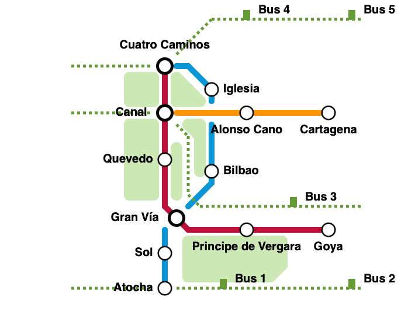

Práctica realizando ejercicios más avanzados de PROLOG

## Objetivos de la sesión

-   Saber formular y escribir código de PROLOG.
-   Desarrollar la capacidad de resolución de problemas de PROLOG.
-   Trabajar en problemas más complejos que requieren varios desarrollos.

## Introducción

En esta sesión se te presentan diferentes ejercicios más complejos que requierirán desarrollos más extensos de programas comletos de PROLOG.

Estos ejercicios supondrán el formato similar al que verás en la práctica final de la asignatura que combina este tipo de ejercicio con preguntas cortas similares a las vistas en la anterior sesión.

## Ejercicio: Personas

Elabora un programa de PROLOG con los siguientes enunciados:

-   Lucía es una mujer.
-   Lucas es un hombre.
-   Lucas es saludable.
-   Lucía es saludable.
-   Lucas es rico.
-   Cualquiera es un viajero si es saludable y rico.
-   Cualquiera puede viajar si es un viajero.

Tu programa deberá de ser capaz de encontrar las siguientes soluciones:

-   ¿Quién puede viajar?
-   ¿Quién es saludable y rico?

## Ejercicio: Animales

Deberás de desarrollar un sistema experto que tenga la cacapcidad de identificar animales en base a sus características proporcionadas. En concreto tenemos interés en identificar a 6 animales distintos: tigre, jirafa, cebra, avestruz, pingüino y albatros.

Las reglas de razonamiento que usará nuestro sistema serán las siguientes:

-   Si X tiene pelo y da leche, entonces es un mamífero.
-   Si X tiene plumas, vuela y pone huevos, entonces es un ave.
-   Si X es mamífero y come carne, entonces es un carnívoro.
-   Si X es mamífero, tiene dientes agudos, tiene garras y tiene ojos que miran hacia delante, entonces es un carnívoro.
-   Si X es un mamífero y tiene pezuñas, entonces es un ungulado.
-   Si X es un mamífero y rumia, entonces es un ungulado.
-   Si X es un carnívoro, de color leonado y tiene franjas negras, entonces es un tigre.
-   Si X es ungulado, tiene patas largas, cuello largo, es de color leonado y tiene manchas oscuras, entonces es una jirafa.
-   Si X es ungulado, de color blanco y con franjas negras, entonces es una cebra.
-   Si X es un ave, no vuela, tiene patas largas, cuello largo y es blanca y negra, entonces es un avestruz.
-   Si X es un ave, no vuela, nada, y es blanca y negra, entonces es un pingüino.
-   Si X es un ave y nada muy bien, entonces es un albatros.

**PARTE A** Para el siguiente conjunto de hechos sobre Luisa:

-   Luisa tiene pelo y da leche.
-   Luisa rumia.
-   Luisa tiene patas largas.
-   Luisa tiene cuello largo.
-   Luisa es de color leonado.
-   Luisa tiene manchas oscuras.

¿Qué animal es Luisa? Razona a partir de las reglas que animal es. Después escribe el programa con los hechos y las reglas para poder confirmar de que animal se trata.

**PARTE B** Para el siguiente conjunto de hechos sobre Felipe:

-   Felipe tiene pelo y da leche.
-   Felipe tiene dientes agudos, garras y ojos que miran hacia delante.
-   Felipe tiene color leonado.
-   Felipe tiene franjas negras.

¿Qué animal es Felipe? Razona a partir de las reglas que animal es. Después escribe el programa con los hechos y las reglas para poder confirmar de que animal se trata.

## Ejercicio: Biblioteca

Hay que desarrollar un sistema experto para gestionar las autorizaciones de préstamo a los usuarios de libros y películas. Para ello necesitamos tener una base de conocimiento compuesta por:

-   usuarios de la biblioteca
-   libros y películas disponibles en el catálogo.
-   libros y películas prestados y a qué usuario.

Por otro lado necesitaremos definir el funcionamiento básico para poder prestar los libros: *Como regla general no se prestára un libro o película a todo usuario que ya tenga un libro o película en préstamo, teniendo en cuenta que si solicita un libro y tiene una película en préstamo si se le concederá el préstamos al ser elementos distintos del catálogo de la biblioteca.*

Teniendo en cuenta que nuestra base de datos se compone de los siguientes hechos:

-   Mario, Carlota, Pablo, Elena y Paula son usuarios de la biblioteca.
-   "Tirant Lo Blanch", "El Quijote", "Juego de Tronos", "El Mundo Perdido", "Los Juegos del Hambre", "Robot Dreams", "El Principito", "Yo Robot" son libros.
-   "El Mundo Perdido", "Dinotopia", "La Vida es Bella", "Robot Dreams" son películas.

Por otro lado, Mario tiene en préstamo el libro "El Quijote", Elena tiene en préstamos la película "La Vida es Bella" y Paula tiene en prestámo tanto el libro como la película de "Robot Dreams".

Construye la base de conocimiento con las reglas necesarias para poder confirmar si un usuario tiene derecho al préstamo de un elemento del catálogo.

Deberá de ser capaz de...

-   Conceder un préstamo a Carlota del libro "Tirant lo Blanch".
-   Conceder un préstamo a Mario de la película "Dinotopia".
-   Denegar un préstamo a Elena de la película "La Vida es Bella".
-   Denegar un préstamo a Pablo del libro "Robot Dreams"

::: callout-tip
## La cláusula `not`

Para este ejercicio podrá resultarte útil usar la cláusula `not` que nos permitirá emular la negación habitual que usamos en lógica de primer orden.

Por ejemplo si queremos demostrar que X no ama a Y sería `not(ama(X,Y))`
:::

## Ejercicio: Metro

Dado el siguiente mapa de metro:

{fig-align="center" width="348"}

Queremos definir en prolog el conocimieto de la estructura de estaciones y líneas. Necesitarás definir:

-   Existen tres líneas de metro: azul, roja y naranja.
-   La línea azul se compone de las paradas: Cuatro Caminos, Iglesia, Bilbao, Gran Vía, Sol y Atocha.
-   La línea roja se compone de las paradas: Cuatro Caminos, Canal, Quevedo, Gran Vía, Príncipe de Vergara, Goya.
-   La línea naranja se compone de las paradas: Canal, Alonso Cano, Cartagena

**Parte A** Define, usando la anterior base de hechos, las reglas necesarias para poder responder a las siguientes relaciones:

-   Una línea tiene transbordo a otra si tienen al menos una parada en común.
-   Se puede llegar de una parada a otra si están en la misma línea.
-   Se puede llegar de una parada a otra, aunque esté en otra línea, si existe un transbordo entre esas líneas.

**Parte B** Si añadimos los siguientes hechos a la base de conocimiento:

``` prolog
conecta_bus(cuatro_caminos).
conecta_bus(canal).
conecta_bus(atocha).
```

Añade una nueva regla que nos indique que *una parada es un intercambiador si en ella paran dos o más líneas distintas y tiene conexión con bus*.

## Ejercicio: Familia

Define los siguientes predicados:

-   hermanos(X,Y) que expresa que dos personas son hermanos.
-   primos(X,Y) que expresa que dos personas son primos.
-   nieto(X,Y) que expresa que X es nieto de Y.
-   descendiente(X,Y) que expresa que X es desciente de Y.

Dada la siguiente base de hechos:

``` prolog
padre(a,b).
padre(a,c).
padre(b,d).
padre(b,e).
padre(c,f).
```

Que define el siguiente árbol familiar:

```{dot}
//| fig-width: 2
//| fig-height: 3

graph {
  a -- b -- d
  b -- e
  a -- c -- f
  
}

```

Desarrolla los predicados anteriores para poder definir de forma correcta las relaciones usando los hechos disponibles.
